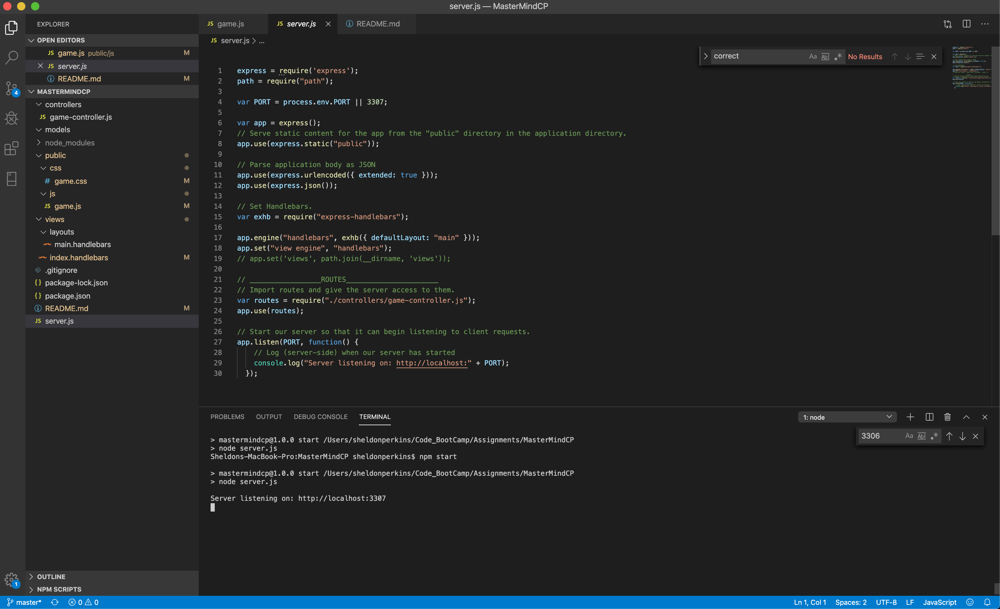
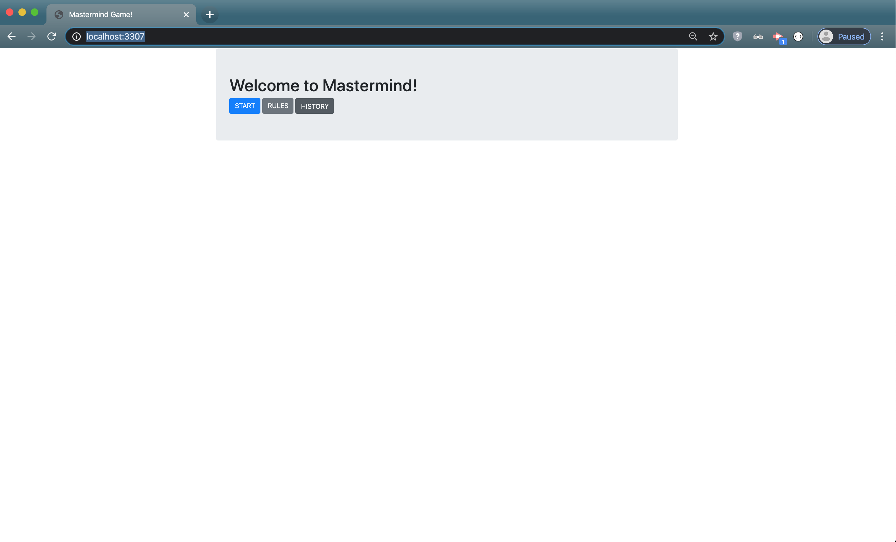
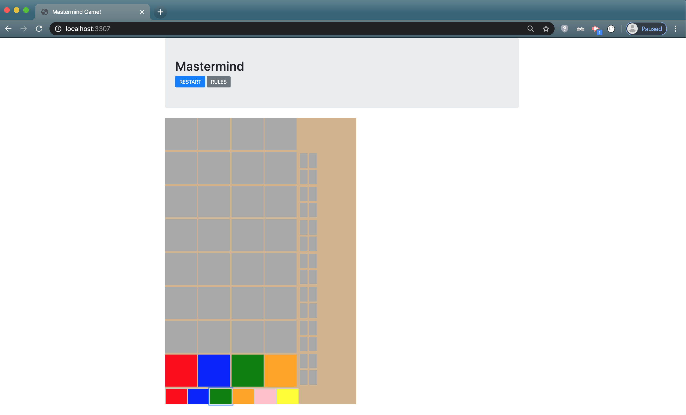
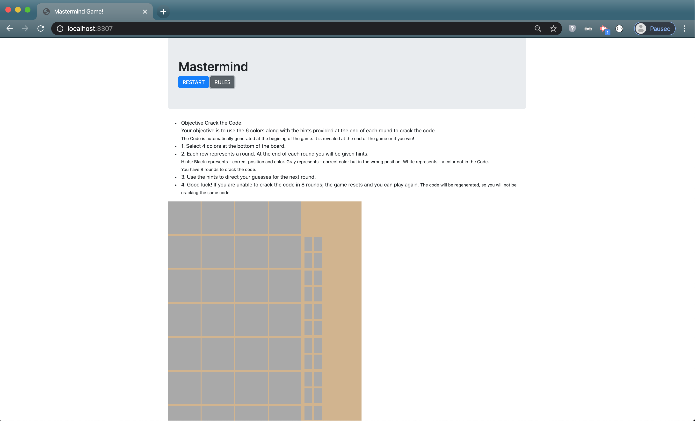

# MasterMindCP

A MVC (Model-View-Controller) application that allows you to play the game mastermind.

## Table of contents
  * [About this project](#about-this-project)
  * [Getting started](#getting-started)
  * [Structure of the project](#structure-of-project)
  * [Screenshots](#screenshots)
  * [Technologies used to create app](#technologies-used)
  	* [Backend technologies](#Backend)
  	* [Frontend technologies](#Frontend)
  * [Design improvements](#design-improvements)
  * [Acknowledgments](#Acknowledgments)
  * [Issues](#Issues)

##  About this project

  * [How the app works](#how-app-works)
  * [Rules](#the-rules)
  * [How the app is built](#how-the-app-is-built)
  * [MVC design pattern](#about-mvc)
 
###  How the app works
This project is an application that allows you to play the mastermind code breaker game. The user uses the start button to view the Game board and trigger the gameSetup() function. This function includes helper functions such as generateCode() to create a unique code to be broken. It also houses the click event for the userGuess() function, that takes the user guess checks it against the code and displays hint pegs corresponding to their degree of correctness.

###  Rules
The Rules are as follows:
1) Enter the Game by clicking the Start button.
2) Choose a sequence of 4 of the possible 6 colors at the bottom of the game board.
3) Use the hints given at the end of each round. These hints are the four small boxes on the right hand side of the board(organized top to bottom, left to right).
4) Repeat steps 2 and 3 until you have won or played all 8 rounds and lost.

###  How the app is built
This project uses Node, Express, Handlebars. Node is used to query and route data in the application. Express is the backend web framework used for this application, and Handlebars is a templating language that is used to generate the HTML.

###  MVC design pattern
This project also follows the MVC (Model-View-Controller) design pattern. The MVC design pattern assigns objects in the application one of three roles (model, view, or controller) and defines the way the different parts of the application communicate with one another.

  * <b>View object:</b>
  A view object is an object in the application that is visible (in the user interface) to the end user of the application. The view displays data from the application's model and learns about any changes to the model data via the controller. For example, in this application, the user enters a burger name in a text field. The view communicates the user input via the controller to the model.

  * <b>Controller object:</b>
  A controller object controls the flow of data between the view and the model (that is, the controller is an intermediary between the two). The controller interprets any user changes made in the view and communicates the changed data to the model. Also, if the model were to change, the controller is what communicates the updated data to the view so that the user can see the updated data in the user interface.

  * <b>Model object:</b>
  A model object manages the data. When data is created or changed by the user in the view (for example, a user devours or throws away a burger), that change is communicated via the controller to the model. Also, when data is created or changed in the model, the model communicates that change via the controller to the view, and the view displays the updated data to the user.

For more information about the MVC design pattern, check out the following resources:
  * https://en.wikipedia.org/wiki/Model%E2%80%93view%E2%80%93controller
  * https://docs.microsoft.com/en-us/aspnet/core/mvc/overview

##  Getting started
The following section will take you through the steps of setting up this application and getting it running locally on your computer.

To set up this application locally on your computer, perform the following steps:
  1. [Clone the repository](#clone-repository)
  2. [Install Node.js](#install-node)
  3. [Install the dependencies](#dependencies)
  4. [Install MySQL Workbench](#install-mysql)
  5. [Set up a development database](#database-setup)
  6. [Create a .env file to store your MySQL Password](#create-env)
  7. [Verify database connection information](#db-connect)
  8. [Start the server](#start-server)

###  1. Clone the repository
The first step is to clone the project repository to a local directory on your computer. To clone the repository, run the following commands:
<pre>
  git clone https://github.com/CeaserSP/MasterMindCP
  cd MasterMindCP
</pre>

####  Structure of the project

After you clone the repository, navigate to the project root directory (burger). The project directory structure is set up as follows:

<ul>
  <li> 
    
<b>server.js</b>: This file does the following:

		<ul>
	    	<li>Defines and requires the dependencies, including express, path, and express-handlebars.</li>
	    	 <li>Sets up the Express server.</li>
	    	 <li>Sets up the Express server to handle data parsing.</li>
	    	 <li>Points the server to the API routes, which gives the server a map of how to respond when users visit or request data from various URLs.</li>
         <li>Defines the port the server is listening on.</li>
	    	 <li>Starts the server.</li>
         <li>Allows the app to serve static content from the public directory.</li>
    	</ul>
  <li>
    
<b>public</b>: Contains the static content (Javascript and CSS). 

    <ul>
      <li><b>./css/game.css</b>: External CSS stylesheet.</li>
      <li><b>assets/js/burger.js</b>: Contains the jQuery and JavaScript functions that allow the application to function as expected.</li>
    </ul>
  </li>
  <li>
    
<b>models</b>: meant to contains functions used to manage the application data and interact with the database.

    
  </li>
  <li>
  <li>
    
<b>controllers</b>: Contains a file called <b>game-controller.js</b>, which contains thr route (GET). This route is used to pass information to and from the view and model objects.

  <li>
    
<b>views</b>: Contains the Handlebars files, which are templates used to generate the html files.
 
  </li>
  <li><b>package.json</b>: Lists the project dependencies (third party npm packages) and their version numbers.</li>
  <li><b>.gitignore</b>: Anything listed inside this file will not be tracked by GitHub when code is committed.</li>
  <li><b>package-lock.json</b>: Dependency tree for the project. Lists all the dependencies and their versions.</li>
</ul>

###  2. Install Node.js

If you don't already have Node.js installed on your computer, you can install the latest version here: https://nodejs.org/en/.

###  3. Install the dependencies

The following npm packages are dependencies to the project.

After you clone the repository to a local directory, change directory to the project root directory and run the following command to install the required npm packages:

<pre>npm install</pre>
<ul>
	<li><b>express</b> -  a Node.js web application framework (https://www.npmjs.com/package/express).</li>
	<li><b>body-parser</b> - used to parse incoming request bodies in a middleware. (https://www.npmjs.com/package/path)</li>
  <li><b>express-handlebars</b> - allows you to use handlebars to create templates to build the HTML.</li>(https://www.npmjs.com/package/express-handlebars)</li>
</ul>

Version information for each of these packages is available in the <b>package.json</b> file in the project root directory.

To verify that the server has started and the application is working locally on your computer, open Chrome and go to <a href="http://localhost:3307">http://localhost:3307</a>.

##  Screenshots

### Welcome to Mastermind

##  Technologies used to build app
* [Backend technologies](#Backend)
* [Frontend technologies](#Frontend)

###  Backend technologies
* Node.js (https://nodejs.org/en/)
* Express (http://expressjs.com/)

###  Frontend technologies
* HTML
* CSS
* Bootstrap (http://getbootstrap.com/)
* Javascript
* jQuery (https://jquery.com/)
* Handlebars (http://handlebarsjs.com/)

##  Design improvements
* Finish the build of the application which includes: Displaying the proper hints, Adding a database for storing user data such as wins and loses, scripting and utilizing helper functions for in game and end of game situations.
* Add better styling and flow to the page.
* Rework handlebars or another view engine to dynamically display the page elements.

##  Issues
* Please note this application is not complete at this time. Users will experience issues until the above improvements are made.

If you find an issue while using the app or have a request, <a href="https://github.com/CeaserSP/MasterMindCP/issues" target="_blank">log the issue or request here</a>. These issues will be addressed in a future code update.

